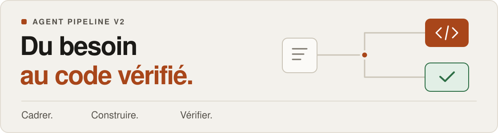

<div align="center">



# Agent Pipeline V2

**Des agents pour développer. Un moteur pour garder le contrôle.**

Pipeline locale de développement avec **Codex CLI**, **Claude Code CLI** ou un adaptateur `command`.

[](CHANGELOG.md)
[](https://github.com/HerbertCodex/agent-pipeline-v2/actions/workflows/ci.yml)
[](package.json)
[](LICENSE)

[Démarrer](#démarrer) · [Les parcours](#les-parcours) · [La qualité](#la-qualité-en-pratique) · [Les guides](#les-guides)

</div>

---

## Le principe

Vous définissez le besoin et approuvez les décisions. Les agents cadrent, implémentent et relisent le code. Le moteur gère les worktrees Git, les contrôles, les preuves et les reprises.

| Cadrer | Construire | Vérifier |
| --- | --- | --- |
| Une spec courte, des critères observables et les décisions du projet. | Des tâches cohérentes, la réutilisation de l’existant et des réparations bornées. | Des tests exécutés, une QA adaptée au risque et un candidat prêt à relire. |

Le **tableau de bord local** rassemble les projets, l’activité des agents, les décisions attendues et les preuves manquantes. Vous gardez la main sur la revue finale et la publication.

## Démarrer

**Prérequis :** Git, Node.js ≥ 22.16 et Linux ou macOS. Installez et authentifiez le CLI du fournisseur choisi. Gardez le framework dans un dossier distinct de l’application.

```bash
git clone https://github.com/HerbertCodex/agent-pipeline-v2.git
cd agent-pipeline-v2
node dist/cli.js --version
node dist/cli.js ui
```

Le JavaScript compilé est livré dans le dépôt. Ouvrez l’adresse locale complète affichée par `ui` : elle contient un jeton d’accès à usage unique.

**Pour démarrer avec votre assistant, utilisez le [prompt de démarrage](START-HERE.md).** Il couvre le choix du fournisseur, la création d’un projet et la configuration d’un dépôt existant.

<details>
<summary><strong>Vous préférez le terminal ?</strong></summary>

Depuis le dossier du framework, préparez la configuration d’un projet existant :

```bash
node dist/cli.js onboard --repo /chemin/mon-application --provider codex --review-mode solo
```

Relisez le plan et suivez son `nextAction` pour l’appliquer. Une fois le projet configuré :

```bash
node dist/cli.js spec draft --repo /chemin/mon-application --request "Décrire la fonctionnalité"
node dist/cli.js spec show SPEC_ID
```

`spec show` indique ensuite l’action attendue : clarification, approbation, exécution ou revue. Pour un nouveau projet, utilisez [`bootstrap`](START-HERE.md). Le [guide du cycle de vie](docs/LIFECYCLE.md) décrit les commandes et les reprises.

</details>

## Les parcours

| Votre besoin | Le parcours |
| --- | --- |
| **Correction locale** au besoin précis | Tâche compacte → implémentation → contrôles. |
| **Fonctionnalité courante** | Product court → implémentation → contrôles → QA ciblée. |
| **Migration, auth ou changement structurant** | Exploration → décision d’architecture → plan → implémentation → validation renforcée. |

Le diff réel peut renforcer les contrôles et rétablir la QA du parcours compact. Une petite modification UI réutilise le design existant. [Détails des parcours →](docs/AMELIORATIONS-2026-09-18.md)

## La qualité en pratique

- **Architecture justifiée.** Un choix structurant expose sa contrainte, l’option plus simple, les compromis, les risques et les conditions de réexamen.
- **Code simple.** Six skills guident la lisibilité, les patterns utiles, le refactoring, la sécurité, les tests et le design UI.
- **Preuves concrètes.** En mode `evidence`, les changements concernés exigent build, intégration ou navigateur ; les cas négatifs de sécurité sont reliés aux fichiers de tests et aux résultats du runner.
- **Blocages utiles.** Une preuve obligatoire manquante suspend la validation sans déclencher automatiquement une réparation de code. Ces contrôles s’appliquent aussi au parcours compact.

**Activation :** les nouvelles configurations `init`/onboarding proposent `workflow.qualityReview: "evidence"`. Un projet existant conserve `legacy` jusqu’à une modification explicite de sa configuration pour une nouvelle spec. Les commandes, labels de couverture et règles de dépendances doivent correspondre au projet. [Configurer les preuves de qualité →](docs/LOT-3-QUALITE.md)

## Les guides

[Consulter toute la documentation →](docs/README.md)

| Pour… | Lire |
| --- | --- |
| Lancer votre premier projet | [Démarrage avec l’assistant](START-HERE.md) |
| Configurer les commandes et les fournisseurs | [Configuration](docs/CONFIGURATION.md) · [Adaptateurs](docs/ADAPTERS.md) |
| Comprendre les rôles et leurs consignes | [Rôles](docs/ROLES.md) · [Skills](docs/SKILLS.md) |
| Suivre une spec, une reprise ou une livraison | [Cycle de vie](docs/LIFECYCLE.md) |
| Exiger des preuves de qualité | [Lot 3 : qualité et validation](docs/LOT-3-QUALITE.md) |
| Comprendre les choix et les frontières | [Architecture](docs/ARCHITECTURE.md) · [Décisions](docs/DECISIONS.md) · [Sécurité](docs/SECURITY.md) · [OWASP](docs/OWASP-SECURITY.md) |
| Consulter les évolutions et les mesures | [Changelog](CHANGELOG.md) · [Améliorations](docs/AMELIORATIONS-2026-09-18.md) · [Performance](docs/PERFORMANCE.md) |

## Développer le framework

```bash
npm ci --ignore-scripts
npm run check
npm run demo:lifecycle
npm run check:package
```

Le [bilan du lot 3](validation/lot3-2026-09-18/summary.json) consigne **446 tests réussis**, le contrôle du paquet et des parcours Chromium sur desktop/mobile et au clavier. Les tests de fournisseurs utilisent des doublures sauf pilote explicite ; ils ne mesurent pas à eux seuls la qualité d’un modèle.

---

**Statut : alpha · Usage local sur des dépôts de confiance.** La pipeline n’est pas une sandbox OS. Les effets externes et la livraison restent explicites. [Limites de sécurité](docs/SECURITY.md) · [Licence MIT](LICENSE)
