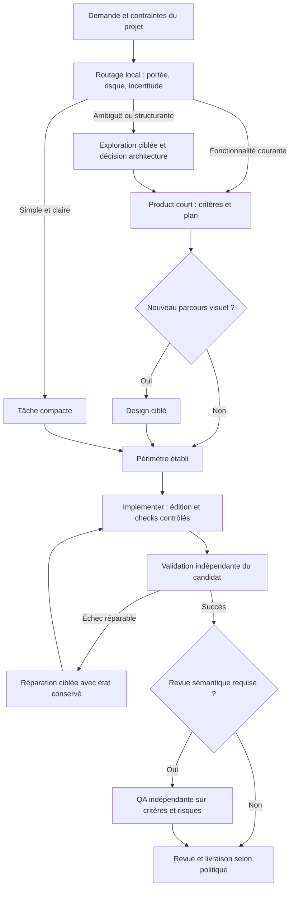

# Audit de la pipeline : robustesse, qualité du code et délai

Audit du 18 septembre 2026. Code étudié : `2.0.0-alpha.8`, commit `b03dd78e417259a8ad34bc9299c061d11e98fc33`. Projet de terrain : `~/ed/project-test`. Les recommandations ci-dessous ne sont pas encore implémentées.

## Verdict

**Conserver le contrôleur déterministe, mais revoir la boucle de travail des agents.** Le socle protège bien les transitions, les candidats Git et les validations. En revanche, la maîtrise des coûts est incomplète, Product produit des documents trop coûteux à réparer et les profils rapides restent insuffisants pour les petites modifications.

La qualité « senior » n'est pas démontrée par le nombre de rôles, la longueur de la spec ou la présence de skills. Elle doit se voir dans les arbitrages, les invariants métier, les tests qui attrapent des défauts et la facilité à faire évoluer le code. Ajouter systématiquement un Architect, un Reviewer et un Security agent augmenterait ici le délai avant d'avoir corrigé ses principales causes.

Le dépassement de 5 $ prouve que **ces exécutions, avec ce modèle, ce contexte et ce protocole, n'ont pas terminé sous ce plafond**. Il ne prouve pas qu'une spec de cette taille doit nécessairement coûter plus de 5 $, ni que vingt minutes de Product constituent une durée normale à accepter.

## Périmètre et niveau de preuve

Lecture des chemins critiques : contrats, configuration, adaptateurs, Product/design/QA, exécution et réparation, Git, persistance, politique de risque, indexation, routage sécurité, onboarding, UI locale, tests et documentation. Lecture ciblée de modules générés dans `project-test`, notamment authentification et journal de sécurité. Il s'agit d'un audit d'architecture et de fonctionnement, pas d'une revue exhaustive de chaque ligne de l'application ni d'un pentest.

Les données proviennent de 21 specs retrouvées dans le store local, couvrant plusieurs révisions du framework. Les anciens défauts observés ne sont donc pas tous encore présents. L'extraction est consultable dans [observations.json](../validation/audit-2026-09-18/observations.json) ; elle conserve des métadonnées compactes, sans prompts ni réponses intégrales. Le store étant vivant, cette extraction ne constitue pas une sauvegarde transactionnelle.

Validation locale : `npm run check`, **382 tests réussis, zéro échec**, environ 89,1 secondes pour la suite de tests, après compilation et vérification TypeScript ; [log conservé](../validation/audit-2026-09-18/check.log). Le premier essai dans le bac à sable n'était pas exploitable : même un processus Node minimal terminait sans transmettre sa sortie. Le diagnostic puis la suite hors bac à sable ont rétabli un comportement normal. Aucun nouvel appel payant à un modèle n'a été lancé pour cet audit.

## Ce que montrent les exécutions réelles

| Observation | Mesure enregistrée | Conséquence |
|---|---|---|
| Incrément 3 avant découpage, spec `11b26b1f…` | 26 tours, environ 21,2 min, 5,01 $ déclarés, arrêt fournisseur | Première limite atteinte ; pas de spec exploitable |
| Spec B, `5e3b3972…` | 26 tours, environ 19,2 min, 5,20 $ déclarés, arrêt fournisseur | Le plafond de 5 $ coupe encore le travail après découpage |
| Nouvelle spec B à 10 $, `be40aad7…` | Réponse rejetée pour `SPEC_SECURITY`, puis seconde invocation de 18,4 min ; total interne mesuré 29,1 min pour cette ronde | Une correction de contrat entraîne une nouvelle rédaction complète |
| Spec A, `7400267d…` | Product et design : 21,1 min cumulées ; workflow actif : 40,2 min | Environ 61,3 min de travail enregistré, hors attente humaine et livraison |
| Spec A : sept tâches Implementer | 35,2 min dans `agentMs`, 57,2 s en validation, 11,7 s en préparation | Le temps modèle/contexte domine ; optimiser les gates ne résout pas ce cas |
| Micro-correction de commentaire, `46cb24d2…` | Product : 58,2 s ; agent : 9,4 s ; QA : 31,1 s | La préparation et la revue coûtent beaucoup plus de temps que l'édition |

Les montants sont des coûts **déclarés par le fournisseur**, pas des factures. Les métriques de cache, raisonnement et tokens sont cumulées selon les conventions du fournisseur ; elles ne décrivent pas la taille d'une seule fenêtre de contexte.

Sur l'échec de la spec B, l'enveloppe conservée déclare `claude-opus-5[1m]` comme modèle principal, ainsi qu'une entrée auxiliaire Haiku. Elle annonce 72 546 tokens de sortie, dont 19 750 de raisonnement, et environ 1,49 million de tokens d'entrée relus en cache. Ces volumes justifient d'instrumenter les étapes et les sorties ; sans trace détaillée des outils, on ne peut pas attribuer précisément le gaspillage à une exploration ou à une régénération donnée.

La configuration actuelle du projet est déjà à **10 $ / 200 tours / 30 minutes**, avec `model: ""`, `roles.product: null` et `roles.qa: null`. Les anciennes specs conservent leur configuration initiale à 5 $. Cette immutabilité est utile à l'audit, mais l'interface doit montrer clairement la configuration réellement utilisée par chaque spec.

## Les bases à conserver

- **Orchestration déterministe** : l'agent ne décide pas lui-même qu'un contrôle est réussi ou qu'une approbation existe.
- **Validation sur un candidat identifié** : worktree propre, reçus liés au commit et à la configuration, invalidation des preuves périmées.
- **Reprise prudente** : pointeurs persistés, baux, journal des processus, conservation du travail interrompu de l'Implementer et adoption explicite.
- **Réparations bornées** : arrêt en cas d'absence de modification ou de mêmes échecs répétés ; pas de boucle infinie volontaire.
- **Décisions métier conservées** : ledger, couverture des décisions, amendements et revue du candidat intégré.
- **Contexte et qualité** : sélection déterministe des skills, recherche de réutilisation, QA séparée de l'Implementer, exigences de tests négatifs.
- **UI locale** : écoute loopback, jeton d'entrée, cookie, protection CSRF, vérification Host et CSP pour les maquettes.
- **Monolithe modulaire sans dépendance npm de production** : adapté à un outil local ; pas de besoin démontré de microservices ou de workflow distribué.

Ces garanties sont substantielles. Elles couvrent cependant surtout l'intégrité du processus, pas la pertinence de tout code produit.

## Défauts prioritaires confirmés

### P0 — Le budget global ne comptabilise pas tout

Dans [service.ts](../src/lifecycle/service.ts), `declaredCostUsd` additionne uniquement les métriques des runs. Les événements `role.finished` de Product, design et QA sont exclus. Dans [pipeline.ts](../src/engine/pipeline.ts), le coût de l'Implementer n'est enregistré qu'après le retour réussi de `runAgent`. Une invocation qui échoue après avoir consommé des tokens échappe donc au compteur. Dans [roles.ts](../src/lifecycle/roles.ts), seules les données d'usage de la dernière réponse acceptée sont attachées à `role.finished` ; les réponses rejetées ne sont pas comptées séparément.

Sur la spec A, les runs avec coût connu représentent **14,84 $**, auxquels s'ajoutent **9,05 $** de rôles explicitement enregistrés. Le total connu est donc **au moins 23,89 $**, avec encore une tâche sans coût enregistré. L'affichage limité aux runs masque déjà 9,05 $ sur ce cas.

`costExceeded` est vérifié avant certaines nouvelles tâches, pas avant chaque appel de rôle ni chaque réparation QA. Il ne réserve pas le coût potentiel de l'appel suivant. `maxSpecCostUsd` est donc actuellement un seuil partiel entre tâches, pas un plafond total fiable. Codex ne fournit aucune métrique d'usage via l'adaptateur actuel.

**Correction proposée :** un journal d'invocations indépendant des verdicts, écrit avant le parsing métier et sur chaque terminaison : rôle, tentative, fournisseur/modèle, durée, usage, coût déclaré, statut et motif d'arrêt. Distinguer `known`, `estimated`, `unknown` ; un coût inconnu ne vaut pas zéro. Faire passer chaque lancement et réparation par le même arbitre de budget. Associer seuil souple, plafond fournisseur quand disponible, réserve pour les contrôles et limite de durée totale. Afficher les dépassements possibles d'un appel déjà engagé.

### P0 — Deux configurations Claude contradictoires

[providers.ts](../src/adapters/providers.ts) retourne toujours `maxTurns: 32, maxBudgetUsd: 5` pour `providerProfile('claude')`. Le schéma de [contracts.ts](../src/domain/contracts.ts) et l'exemple Claude sont à 200 tours et sans plafond par défaut. Le test Claude vérifie encore explicitement les 32 tours.

Ce défaut explique pourquoi un onboarding utilisant le profil peut réintroduire les anciennes limites. Il ne suffit pas, seul, à expliquer la spec B : celle-ci avait déjà 200 tours mais conservait 5 $ dans sa configuration enregistrée.

**Correction proposée :** une seule définition de profil, consommée par onboarding, exemples, pilote et tests. Séparer le profil conservateur d'une fixture payante du profil normal. Ne pas supprimer le plafond monétaire global pour résoudre une incohérence de configuration. Prévoir un amendement opérationnel auditable pour un budget ou modèle d'une spec existante, sans modifier son périmètre fonctionnel.

### P0 — La réparation Product repart sans la réponse à réparer

`repairNotice` transmet le code d'erreur et son message, puis demande une réponse corrigée complète. Le prochain appel reçoit le contexte d'origine, mais **pas la réponse rejetée**. Claude est en outre appelé avec `--no-session-persistence`. Le contrôleur ne peut ni reprendre la session ni récupérer un brouillon partiel Product après interruption.

L'exemple observé est précis : `Security profile cannot downgrade detected surface dependencyChange`. Une règle portant sur un booléen a déclenché une nouvelle invocation de 18,4 minutes. Le timeout est réinitialisé à chaque invocation ; une ronde avec réparation peut dépasser le timeout individuel. La durée Product n'entre pas non plus dans `workflow.maxActiveMs`, démarré ensuite par `run`.

**Correction proposée :** conserver la proposition candidate bornée avec son hash, même refusée ; retourner des erreurs structurées avec chemins JSON ; demander un patch limité aux champs autorisés, puis revalider le document entier. Les faits calculés par le contrôleur, comme un minimum de sécurité, doivent être assemblés par lui plutôt que recopiés par le modèle. Les analyses, exigences et preuves correspondantes restent à produire et à vérifier. Ajouter une échéance et un budget communs à toute la ronde, réparations comprises.

### P0 — Le routage sécurité confond contexte global et changement courant

`product` appelle `assessSecurity` sur la demande **et l'ensemble du Decision Ledger**. Le routeur de [owasp.ts](../src/security/owasp.ts) utilise des mots-clés sans comprendre négations, exclusions ou temporalité. Dans le projet, une ancienne décision sur npm, `package-lock.json` et le premier `npm install` active `dependencyChange`, même pour une tâche qui ne change pas les dépendances. La mention `.agent-pipeline/ARCHITECTURE.md` contient aussi le mot `pipeline`, suffisant pour déclencher CI/CD.

Reproduction locale : « Ne pas modifier package.json. Aucun changement de pipeline CI. » retourne `dependencyChange: true` et `ciCd: true`. Cela transforme une précaution hors périmètre en obligation de planification. L'échec Product de la spec B illustre le coût pratique de cette confusion.

**Correction proposée :** distinguer profil permanent du projet, surfaces effectivement concernées par la tâche et signaux incertains. Conserver les exigences permanentes pertinentes, mais ne pas assimiler leur simple mention à une modification. Chaque signal doit porter sa provenance et son niveau de certitude. Après implémentation, réévaluer sur le diff réel. Un modèle ne doit pas pouvoir supprimer un signal confirmé ; il peut proposer de reclasser un signal lexical avec une justification vérifiable. Un simple ajout de regex de négation ne suffira pas.

### P1 — La boucle d'édition Claude est privée de feedback d'exécution immédiat

[claude.ts](../src/adapters/claude.ts) autorise seulement lecture/recherche/édition. Bash, outils web, MCP et sous-agents sont interdits. Cette restriction évite des exécutions incontrôlées, mais l'Implementer ne peut pas tester une hypothèse ni faire un véritable cycle rouge/vert pendant sa session. Il écrit puis attend la validation externe ; une erreur impose un nouvel appel avec contexte reconstruit. Le skill TDD est une consigne, pas une capacité effectivement disponible.

**Correction proposée :** exposer une petite interface contrôlée, par exemple `run_check(checkId, target)` et des opérations de génération explicitement configurées. Le runner choisit les commandes et les exécute dans un environnement isolé ; les résultats reviennent à la session. Conserver la validation finale indépendante sur commit propre. Le nombre de checks interactifs et leur durée doivent être bornés. Si l'interface CLI choisie ne permet pas ce dialogue proprement, utiliser un SDK derrière l'adaptateur, après comparaison sur les mêmes tâches.

### P1 — Le parcours de petite modification reste trop lourd

Les lanes modulent surtout les gates et la QA **après** la planification. Une micro-correction passe encore par Product. `requiresDesign` déclenche une proposition pour tout impact UI déclaré, même `minor`, et peut également se déclencher sur du vocabulaire présent dans la description. Une retouche locale peut donc entraîner une nouvelle maquette, puis une nouvelle lecture de celle-ci par l'Implementer.

**Correction proposée :** un routage initial par portée, risque et incertitude. Une demande claire et locale peut devenir une tâche compacte avec critères et périmètre, sans rédaction Product complète. Réutiliser le design approuvé pour les ajustements mineurs ; produire une maquette pour un nouveau parcours ou une modification visuelle substantielle. Réévaluer la lane sur le diff et escalader si la portée réelle dépasse l'estimation.

### P1 — Modèle, effort et coûts ne sont pas pilotés par rôle

La configuration permet déjà un modèle par rôle, mais le projet hérite partout de `model: ""`. Les traces d'échec montrent l'utilisation d'Opus ; le contrôleur ne journalise pas systématiquement le modèle effectif ni ses tokens. Il n'expose pas non plus un réglage typé de l'effort de raisonnement.

**Correction proposée :** fixer les modèles et enregistrer les versions CLI, le modèle demandé et celui réellement déclaré. Tester un profil rapide sur les tâches locales et réserver un profil plus coûteux aux migrations, arbitrages ambigus et réparations difficiles. Choisir sur le coût jusqu'à acceptation et le taux de réussite, pas sur le prix du token. Ne pas décréter qu'un petit modèle sera toujours plus économique : ses reprises peuvent annuler l'économie.

### P1 — Les contrôles ne démontrent pas encore le niveau de qualité attendu

La configuration de `project-test` exécute `diff-check`, Vitest et `svelte-check`. Aucun gate de build de production, lint, dépendances architecturales ou parcours navigateur n'y figure. QA lit le diff, les fichiers et les reçus, mais son adaptateur Claude ne dispose pas de navigateur. Une QA positive ne prouve donc pas le rendu, le focus clavier, le comportement réseau ou l'intégration de production.

Les tests du framework valident principalement ses protocoles et invariants avec des doubles. Le benchmark du scheduler chronomètre des temporisations Node ; il ne mesure ni architecture générée, ni maintenabilité, ni coût réel d'une feature. Le pilote de réparation réel documenté est utile, mais trop étroit pour qualifier une pipeline de développement.

**Correction proposée :** compléter les gates selon le projet : build, lint configuré, tests d'intégration et deux ou trois parcours E2E critiques. Garder les checks rapides près de l'édition, la validation complète au candidat intégré. Ajouter des évaluations de qualité sur tâches réelles, avec tests indépendants des agents et revue humaine de l'architecture.

### P2 — Maintenabilité et observabilité du framework

`Lifecycle` concentre environ 1 300 lignes : orchestration, budget, montage du contexte, design HTML/CSS, assets, revue, reprise et livraison. Certains modules de politique sont très compressés. Le problème n'est pas un seuil de lignes en soi : ces responsabilités évoluent indépendamment et rendent les corrections transverses difficiles, comme le montre la comptabilité répartie.

La UI affiche des événements de début/fin de rôle, pas une progression fournisseur ni les tokens. Les instructions de rôle sont répétées dans `guidance.role.instructions`, `instructions` et le préambule natif. Le budget de skills ne borne ni le prompt total ni les lectures d'outils. Les fichiers de sortie de rôle sont supprimés après traitement ; un hash ne permet pas de rejouer le diagnostic.

**Correction proposée :** extraire progressivement `ProviderRunner`, `InvocationLedger/BudgetPolicy`, montage des contextes et gestion du design, sans changement de comportement initial. Versionner le protocole d'invocation et les artefacts. Ajouter événements normalisés, taille du contexte initial, volume lu, cache, sortie, progression et arrêt explicite. La UI doit distinguer coût connu, coût manquant, travail achevé et appel en cours. La reprise d'un job UI après redémarrage doit s'appuyer sur les événements persistés, plutôt que sur la seule Map en mémoire.

Défaut secondaire reproduit : `workflow.maxSpecCostUsd` utilise `s.number`, qui impose un entier ; `25.5` est refusé, contrairement à `agent.maxBudgetUsd`, qui accepte les décimales via `s.finite`.

## État de l'art et application au projet

Il n'existe pas une architecture universelle gagnante. Les résultats publiés soutiennent surtout des boucles simples, un contexte sélectionné, un feedback d'exécution et des évaluations de bout en bout.

| Pratique documentée | Application recommandée ici |
|---|---|
| Partir du workflow le plus simple et ajouter des étapes quand leur valeur est mesurée | Garder le contrôleur ; réduire les rôles obligatoires pour les petites tâches. [Anthropic, Building effective agents](https://www.anthropic.com/engineering/building-effective-agents) |
| Réduire la génération et les appels séquentiels pour réduire la latence | Specs courtes, patch de réparation, regroupement des opérations réellement liées. [OpenAI, Latency optimization](https://developers.openai.com/api/docs/guides/latency-optimization) |
| Sélectionner les informations utiles plutôt que remplir la fenêtre de contexte | Sous-ensemble pertinent du ledger, snippets ciblés, contraintes courtes, références consultables à la demande. [Anthropic, Context engineering](https://www.anthropic.com/engineering/effective-context-engineering-for-ai-agents) |
| Progresser par incréments vérifiables avec artefacts de reprise | Checkpoints Product et Implementer, résultat partiel explicite, état conservé après interruption. [Anthropic, Effective harnesses](https://www.anthropic.com/engineering/effective-harnesses-for-long-running-agents) |
| Séparer production et évaluation quand l'auto-évaluation est insuffisante | Conserver QA indépendante sur les changements substantiels ; calibrer ses constats sur des défauts réels. [Anthropic, Harness design](https://www.anthropic.com/engineering/harness-design-long-running-apps) |
| Combiner vérifications par code, juges modèles et appréciation humaine | Tests métier indépendants, revue d'architecture et mesures de défauts échappés. [Anthropic, Demystifying evals](https://www.anthropic.com/engineering/demystifying-evals-for-ai-agents) |
| Les interfaces natives permettent des sessions reprises et des sorties structurées | Les capacités de reprise existent côté fournisseurs ; leur intégration contrôlée manque ici. [Claude Code CLI](https://code.claude.com/docs/en/cli-reference), [Codex non interactif](https://learn.chatgpt.com/docs/non-interactive-mode) |

Ces sources donnent des principes et des expériences, pas une preuve que cette pipeline atteindra un délai précis. L'article Harness design d'Anthropic souligne aussi que le besoin de resets, d'évaluateurs et de découpage change avec les modèles : il faut pouvoir simplifier le dispositif quand une nouvelle version n'a plus besoin de certaines étapes.

La reprise de session convient surtout à une réparation d'une même tâche. Une nouvelle tâche doit recevoir un contexte choisi ; QA doit conserver une vue indépendante. Ne pas transformer la reprise en conversation unique et illimitée de toute la feature.

## Architecture cible proposée



Chaque appel passe par le même suivi de budget, de deadline et de progression. Les étapes ne signifient pas obligatoirement un agent ou un appel distinct. Une décision d'architecture courte peut faire partie de Product ; un code local peut être compris et édité dans une seule session.

**Product courant :** problème, périmètre, quelques critères observables, contraintes pertinentes et une à trois unités cohérentes quand cela suffit. Le nombre n'est pas une règle dure. Découper une tâche volumineuse par capacité livrable, pas par obligation de créer une tâche par fichier ou couche. La documentation associée doit accompagner la tâche qui change le contrat, sauf nécessité réelle d'une synthèse finale.

**Product complexe :** exploration bornée, résultat sauvegardé, décision structurante, puis plan. La sauvegarde limite la perte en cas d'arrêt ; ce parcours supplémentaire ne doit pas être imposé aux petites features.

**Contexte :** conserver l'inventaire lexical comme index de découverte, sans le présenter comme une analyse sémantique. Réutilisation guidée par responsabilités et contrats ; pas uniquement par noms. Introduire AST/graphe d'import de façon ciblée là où les erreurs d'impact le justifient, avant un chantier RAG général.

**Parallélisme :** continuer à paralléliser les checks sans conflit ; envisager ensuite au plus deux tâches d'implémentation réellement indépendantes, avec worktrees distincts et validation d'intégration. Le verrou global actuel les sérialise. Ne pas retirer ce verrou sans protocole d'intégration : les conflits et revalidations peuvent effacer le gain.

**Budgets :** séparer une cible de performance d'un arrêt brutal. À l'approche de la cible, sauvegarder, réduire la portée ou escalader ; à la limite dure, arrêter avec un état récupérable. Les trente minutes autorisées à un agent doivent laisser du temps aux checks ; dans le projet actuel `maxRunMs` et `agent.timeoutMs` valent tous deux trente minutes.

## Ce qui doit produire du code de niveau senior

### Architecture proportionnée

Une décision structurante doit répondre brièvement à : contrainte réelle, option retenue, option simple écartée, compromis, risque de migration et condition de réexamen. Pas d'ADR obligatoire pour une correction locale. Privilégier les abstractions de la stack et l'architecture déjà cohérente, sauf problème démontré.

Pour la pipeline elle-même, Adapter convient aux fournisseurs, une machine à états explicite aux transitions, et des fonctions de policy aux règles. Une interface d'exécution commune est utile ; multiplier classes et factories autour de chaque opération ne l'est pas. Ni CQRS, ni event sourcing généralisé, ni microservices ne sont justifiés par les observations actuelles.

Pour l'application de librairie, les modules métiers, requêtes préparées et horloges injectables observés dans `security-log` sont de bons choix simples. Le fichier d'authentification couvre plusieurs responsabilités ; une séparation se justifiera par l'évolution de leurs contrats, pas seulement parce qu'il a 518 lignes. Cet échantillon encourageant ne certifie pas tout le code généré.

### Une grille de qualité vérifiable

| Axe | Preuve attendue |
|---|---|
| Comportement | Critères satisfaits, erreurs explicites, cas limites pertinents |
| Architecture | Dépendances cohérentes, interfaces stables, compromis expliqué si changement structurel |
| Simplicité | Abstraction justifiée par un besoin actuel, absence de framework interne inutile |
| Réutilisation | Responsabilité existante réemployée ou raison concrète de ne pas la réutiliser |
| Tests | Régression qui échoue avant correction, tests d'intégration des frontières, peu de mocks des règles métier |
| Sécurité | Autorisation et validation aux frontières, tests négatifs, données et secrets maîtrisés |
| Exploitation | Migration, reprise, idempotence, erreurs et observabilité adaptées au changement |
| UI | Parcours réel, états d'erreur/vide/chargement, clavier et responsive vérifiés quand concernés |

Les seuils mécaniques de taille/complexité peuvent signaler une dette, mais ne doivent pas imposer des découpages artificiels. QA doit bloquer sur un problème concret et expliquer son impact. Un goût de nommage ou un commentaire perfectible ne doit pas déclencher systématiquement une nouvelle ronde entière.

Il faut également surveiller les tests qui ne font que chercher une chaîne dans le code source : ils peuvent protéger une interdiction explicite, mais ne remplacent pas un test de comportement ou de rendu.

## Délais cibles et mesure

Objectifs initiaux à calibrer, **pas performances acquises ni garanties**. Le chronomètre commence à la demande exploitable et finit au candidat validé ; l'attente humaine est mesurée séparément.

| Classe | Exemple | Cible initiale |
|---|---|---|
| Micro | Commentaire, style local, petit correctif évident | 1–5 min |
| Petite | Validation de formulaire, endpoint local, bug avec régression | 5–12 min |
| Moyenne | Fonctionnalité traversant quelques modules | 15–30 min |
| Structurante | Migration, authentification, anonymisation, nouveau parcours complet | Découpage et estimation propres ; pas de promesse universelle sous 30 min |

La spec B touche anonymisation, rétention, déclenchement des purges et plusieurs écrans. Elle est structurellement plus risquée qu'une fonctionnalité CRUD locale. Un cadrage plus attentif est justifié ; trente minutes de régénération pour un champ de profil ne le sont pas.

Sur la spec A, rendre les validations gratuites n'économiserait qu'environ une minute sur les sept tâches. Réduire les relectures, fusionner des unités trop fines, limiter la rédaction et améliorer le feedback est donc prioritaire. Le cache d'installation reste utile sur de plus gros projets, avec identité du lockfile/toolchain et environnements propres.

### Protocole d'évaluation proposé

1. Constituer 12 à 20 tâches historiques reproductibles : micro-correction, fonctionnalité, bug, migration, auth, refactoring, UI. Conserver le même commit initial et les mêmes critères.
2. Comparer un agent natif avec la CI du projet, la pipeline actuelle et la version corrigée. Même modèle dans un premier temps pour isoler l'effet de l'orchestration.
3. Prévoir deux ou trois répétitions pour une première tendance, puis élargir avant d'annoncer un p95 crédible. Limiter explicitement le budget de cette campagne.
4. Utiliser des tests d'acceptation indépendants et une revue d'architecture sur diff anonymisé. Un agent qui a écrit le test ne doit pas être le seul juge de sa pertinence.
5. Mesurer temps jusqu'à acceptation, taux de réussite sans intervention, reprises, changements de scope, coûts connus/manquants, qualité de maintenance et défauts échappés. Inclure les runs arrêtés et les abandons ; ne pas calculer la vitesse sur les seuls succès.
6. Tester ensuite les profils de modèles et d'effort. Conserver l'option rapide seulement si elle préserve les résultats attendus.

## Plan de réalisation ordonné

| Lot | Livrable | Critère d'acceptation |
|---|---|---|
| 1 — Mesure et limites | Journal de chaque invocation, coûts de tous les rôles/échecs, profils unifiés, deadline totale | Une tentative rejetée compte ; un coût inconnu reste visible ; un nouveau call respecte la politique commune |
| 2 — Product récupérable et conventions CSS | Réponse refusée conservée, erreurs structurées, patch de réparation, checkpoints, filtrage des signaux sécurité ; BEM par défaut pour le CSS global, skills cohérents et gate de nommage | Une erreur locale se répare à partir du document conservé ; les contraintes confirmées restent intactes ; un nom CSS invalide échoue au contrôle BEM configuré, les conventions scoped/modules/utilitaires restent respectées |
| 3 — Parcours court | Tâche compacte, design réutilisé, contexte pertinent, profils par rôle | Une micro-correction ne déclenche plus une nouvelle spec et maquette complètes |
| 4 — Feedback et qualité | Checks contrôlés dans la boucle, validation finale indépendante, build/E2E ciblés, grille de revue | L'agent observe ses erreurs tôt ; les preuves finales restent produites indépendamment |
| 5 — Calibration | Jeu de tâches, comparaison de modèles et parcours, tableau coûts/qualité/délais | Gains mesurés à qualité comparable, avec échecs et interventions inclus |

Éviter une réécriture globale du framework. Les premiers lots touchent des frontières déjà présentes et peuvent être livrés progressivement. Le refactoring de `Lifecycle` doit accompagner ces extractions, sans retarder les corrections opérationnelles.

La numérotation du tableau est celle de l'audit initial. Dans la demande ultérieure, le **lot 2 « Boucle plus courte »** regroupe les reprises, les trois parcours, les checks en session, les contextes sélectionnés, les profils et BEM. Son état est suivi dans [le lot 2 demandé](AMELIORATIONS-2026-09-18.md#lot-2--boucle-courte-et-conventions-css) ; l'ancien bilan « Product récupérable » seul ne couvrait pas ce périmètre.

Tests de régression importants pour ces lots : coût d'un Product refusé puis réparé ; coût d'un Implementer interrompu ; coût QA et design inclus ; plafond vérifié avant réparation QA ; budget fractionnaire ; cohérence des profils ; contexte négatif sans faux changement de dépendances ; deadline commune aux repairs ; checkpoint récupérable après crash ; préservation des approbations et du contrôle de scope.

## Reproduire les constats locaux

Après `npm ci --ignore-scripts` et `npm run build` :

```bash
node validation/audit-2026-09-18/reproduce.mjs
npm run check
```

Le premier script confirme volontairement les comportements problématiques du code audité ; il faudra adapter ses assertions après correction. Il ne lance aucun agent ni commande de projet.

Pour réextraire les métadonnées d'un store local, sans ouvrir le contrôleur ni modifier sa base :

```bash
node validation/audit-2026-09-18/collect-observations.mjs \
  /chemin/control.sqlite /chemin/projet /tmp/observations.json
```

La collecte ne récupère pas les conversations fournisseur absentes du store. Les coûts manquants des runs historiques ne peuvent pas être reconstruits honnêtement à partir d'un seul hash de sortie.
