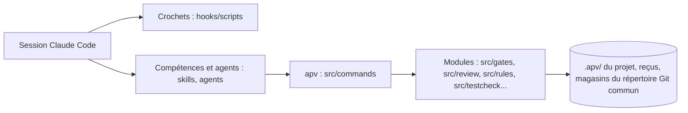

# Carte de l'architecture

Vue d'ensemble du projet, à lire en premier (cinq minutes), puis la carte du code ([.apv/code-map.md](../.apv/code-map.md)). Pile : projet sans pile reconnue ([dossiers par fonctionnalité](https://legacy.reactjs.org/docs/faq-structure.html)).
Les parties générées sont réécrites par `apv map` (et `apv structure map`) ; les parties écrites, entre marqueurs `apv:ecrit`, ne sont jamais touchées par l'outil. Un dossier de premier ou de deuxième niveau, une route principale ou un point d'entrée ajouté sans rôle dans « Rôles » fait échouer le contrôle `structure`.

## En bref

<!-- apv:ecrit:resume -->
Agent Pipeline V3 (`apv`) : un plugin Claude Code et sa ligne de commande, qui encadrent un chef de projet et ses agents (specs, contrôles prouvés au commit, relectures scellées, fusions tracées). Pour l'opérateur d'un projet livré par des agents, sur sa machine.
<!-- /apv:ecrit:resume -->

## Couches et flux

<!-- apv:ecrit:flux -->
Pas de base de données ni de serveur : la migration listée plus bas est une donnée de test. Les crochets du plugin (`hooks/`) gardent les sessions ; les compétences (`skills/`) et les agents (`agents/`) disent la méthode ; la commande `apv` (`src/`, compilée dans `dist/`) lit `.apv/` du projet, lance ses contrôles et écrit ses reçus et ses magasins dans le répertoire Git commun.

<!-- /apv:ecrit:flux -->

## Arborescence

<!-- apv:genere:arborescence -->
- `agents/` : définitions des agents du plugin (implementer, intégrateur, relecteurs, architectes, product, DPO, designer).
- `bin/` : lanceur `apv` du plugin.
- `docs/` : documentation du projet.
  - `docs/assets/` : images de la documentation.
  - `docs/v2/` : documentation historique de la V2.
- `examples/` : configurations d'exemple pour un projet.
- `hooks/` : déclaration des crochets du plugin dans Claude Code.
  - `hooks/scripts/` : crochets (Bash, sceau des relectures, journal de l'opérateur, début de session).
- `skills/` : compétences du plugin, une par dossier (`SKILL.md`, instructions des agents).
  - `skills/architecture-donnees/` : une compétence : sa procédure (`SKILL.md`) et ses références.
  - `skills/chef-de-projet/` : une compétence : sa procédure (`SKILL.md`) et ses références.
  - `skills/clean-code/` : une compétence : sa procédure (`SKILL.md`) et ses références.
  - `skills/design-artefact/` : une compétence : sa procédure (`SKILL.md`) et ses références.
  - `skills/design-patterns/` : une compétence : sa procédure (`SKILL.md`) et ses références.
  - `skills/design/` : une compétence : sa procédure (`SKILL.md`) et ses références.
  - `skills/init/` : une compétence : sa procédure (`SKILL.md`) et ses références.
  - `skills/onboard/` : une compétence : sa procédure (`SKILL.md`) et ses références.
  - `skills/preview/` : une compétence : sa procédure (`SKILL.md`) et ses références.
  - `skills/quota/` : une compétence : sa procédure (`SKILL.md`) et ses références.
  - `skills/refactoring/` : une compétence : sa procédure (`SKILL.md`) et ses références.
  - `skills/resume/` : une compétence : sa procédure (`SKILL.md`) et ses références.
  - `skills/review/` : une compétence : sa procédure (`SKILL.md`) et ses références.
  - `skills/rgpd/` : une compétence : sa procédure (`SKILL.md`) et ses références.
  - `skills/run/` : une compétence : sa procédure (`SKILL.md`) et ses références.
  - `skills/security/` : une compétence : sa procédure (`SKILL.md`) et ses références.
  - `skills/spec/` : une compétence : sa procédure (`SKILL.md`) et ses références.
  - `skills/stack/` : une compétence : sa procédure (`SKILL.md`) et ses références.
  - `skills/status/` : une compétence : sa procédure (`SKILL.md`) et ses références.
  - `skills/structure/` : une compétence : sa procédure (`SKILL.md`) et ses références.
  - `skills/tdd/` : une compétence : sa procédure (`SKILL.md`) et ses références.
  - `skills/ui-design/` : une compétence : sa procédure (`SKILL.md`) et ses références.
  - `skills/web-qualite/` : une compétence : sa procédure (`SKILL.md`) et ses références.
- `src/` : sources du projet. Convention : dossiers par fonctionnalité ([documentation](https://legacy.reactjs.org/docs/faq-structure.html)).
  - `src/commands/` : une commande `apv` par fichier (analyse des options, sortie texte et JSON). Convention : dossiers par fonctionnalité ([documentation](https://legacy.reactjs.org/docs/faq-structure.html)). Dossier à plat (29 fichiers de code, seuil 12) : ne pas y ajouter de fichier.
  - `src/config/` : chargement et validation de `.apv/config.json`. Convention : dossiers par fonctionnalité ([documentation](https://legacy.reactjs.org/docs/faq-structure.html)).
  - `src/db/` : `apv db check`, contrôle du modèle de données. Convention : dossiers par fonctionnalité ([documentation](https://legacy.reactjs.org/docs/faq-structure.html)).
  - `src/design/` : maquettes validées (versement, empreinte, dérive). Convention : dossiers par fonctionnalité ([documentation](https://legacy.reactjs.org/docs/faq-structure.html)).
  - `src/domain/` : contrats partagés (schémas, erreurs, chemins, empreintes, version). Convention : dossiers par fonctionnalité ([documentation](https://legacy.reactjs.org/docs/faq-structure.html)).
  - `src/engine/` : ordonnancement des contrôles et diagnostics. Convention : dossiers par fonctionnalité ([documentation](https://legacy.reactjs.org/docs/faq-structure.html)).
  - `src/evidence/` : clé de preuve des reçus. Convention : dossiers par fonctionnalité ([documentation](https://legacy.reactjs.org/docs/faq-structure.html)).
  - `src/execution/` : processus, Git, environnement transmis. Convention : dossiers par fonctionnalité ([documentation](https://legacy.reactjs.org/docs/faq-structure.html)).
  - `src/gates/` : `apv gates run` et `verify` : contrôles, suite complète, répétition des tests modifiés, portée, preuve incrémentale (`--since`). Convention : dossiers par fonctionnalité ([documentation](https://legacy.reactjs.org/docs/faq-structure.html)).
  - `src/knowledge/` : inventaire du dépôt. Convention : dossiers par fonctionnalité ([documentation](https://legacy.reactjs.org/docs/faq-structure.html)).
  - `src/lifecycle/` : cycle de vie hérité de la V2. Convention : dossiers par fonctionnalité ([documentation](https://legacy.reactjs.org/docs/faq-structure.html)).
  - `src/lock/` : verrous à bail. Convention : dossiers par fonctionnalité ([documentation](https://legacy.reactjs.org/docs/faq-structure.html)).
  - `src/onboard/` : reprise d'un projet existant (`apv onboard`). Convention : dossiers par fonctionnalité ([documentation](https://legacy.reactjs.org/docs/faq-structure.html)).
  - `src/policy/` : voies de risque, chemins sensibles, motifs de chemins. Convention : dossiers par fonctionnalité ([documentation](https://legacy.reactjs.org/docs/faq-structure.html)).
  - `src/preview/` : aperçu vivant d'une branche. Convention : dossiers par fonctionnalité ([documentation](https://legacy.reactjs.org/docs/faq-structure.html)).
  - `src/quality/` : axes de la revue de qualité. Convention : dossiers par fonctionnalité ([documentation](https://legacy.reactjs.org/docs/faq-structure.html)).
  - `src/quota/` : relevé du quota d'usage. Convention : dossiers par fonctionnalité ([documentation](https://legacy.reactjs.org/docs/faq-structure.html)).
  - `src/reuse/` : `apv reuse check` et carte du code. Convention : dossiers par fonctionnalité ([documentation](https://legacy.reactjs.org/docs/faq-structure.html)).
  - `src/review/` : `apv review plan` (domaines et niveau de risque du diff) et `apv dast run`. Convention : dossiers par fonctionnalité ([documentation](https://legacy.reactjs.org/docs/faq-structure.html)).
  - `src/rules/` : `apv rules check` : règles avant fusion, relectures scellées, journal de l'opérateur, ancrage. Convention : dossiers par fonctionnalité ([documentation](https://legacy.reactjs.org/docs/faq-structure.html)).
  - `src/run/` : état et rythme d'une exécution de spec. Convention : dossiers par fonctionnalité ([documentation](https://legacy.reactjs.org/docs/faq-structure.html)).
  - `src/security/` : signaux de sécurité et grille OWASP. Convention : dossiers par fonctionnalité ([documentation](https://legacy.reactjs.org/docs/faq-structure.html)).
  - `src/spec/` : validation et gabarit des specs. Convention : dossiers par fonctionnalité ([documentation](https://legacy.reactjs.org/docs/faq-structure.html)).
  - `src/stack/` : pile de PR, fusion tracée, lots. Convention : dossiers par fonctionnalité ([documentation](https://legacy.reactjs.org/docs/faq-structure.html)).
  - `src/stacks/` : piles de test déclarées (verrou, arrêt des piles inactives). Convention : dossiers par fonctionnalité ([documentation](https://legacy.reactjs.org/docs/faq-structure.html)).
  - `src/structure/` : `apv structure check` et carte de l'architecture. Convention : dossiers par fonctionnalité ([documentation](https://legacy.reactjs.org/docs/faq-structure.html)).
  - `src/testcheck/` : contrôles déterministes des tests modifiés (`apv tests check` : attente à durée fixe, horloge réelle, données partagées). Convention : dossiers par fonctionnalité ([documentation](https://legacy.reactjs.org/docs/faq-structure.html)).
  - `src/web/` : `apv web audit`, qualité des pages publiques. Convention : dossiers par fonctionnalité ([documentation](https://legacy.reactjs.org/docs/faq-structure.html)).
- `test/` : tests de l'outil (`node --test`).
  - `test/fixtures/` : dépôts et données de test.
  - `test/support/` : utilitaires partagés des tests.
- `validation/` : dossiers de validation datés des versions antérieures.
  - `validation/execution-policy-2026-09-19/` : une validation : protocole et résultats.
  - `validation/qa-cleanup-2026-09-19/` : une validation : protocole et résultats.
  - `validation/short-loop-2026-09-18/` : une validation : protocole et résultats.
- `workflows/` : workflows du plugin (revues en parallèle, vagues d'implementers).
<!-- /apv:genere:arborescence -->

## Points d'entrée

<!-- apv:genere:entrees -->
Fichiers et dossiers appelés par le cadre ou la plateforme :

- [`test/fixtures/db-suivie/supabase/migrations/`](../test/fixtures/db-suivie/supabase/migrations) : migrations d'un projet témoin, pour les tests de `apv db check`.
<!-- /apv:genere:entrees -->

## Règles transverses

<!-- apv:ecrit:regles -->
- Consigne commune (règles de code, contrôles, verrous) : [.apv/brief.md](../.apv/brief.md)
- OWASP-SECURITY : [docs/OWASP-SECURITY.md](OWASP-SECURITY.md)
- SECURITY : [docs/SECURITY.md](SECURITY.md)
- Sécurité, accès, données, tests : à compléter si un sujet manque ci-dessus.
<!-- /apv:ecrit:regles -->

## Pour aller plus loin

<!-- apv:genere:liens -->
- [README du projet](../README.md)
- [Carte du code (composants, modules, routes) : .apv/code-map.md](../.apv/code-map.md)
- [Consigne commune des implementers : .apv/brief.md](../.apv/brief.md)
- [Specs](../.apv/specs)
- [APV3-SPEC.md](APV3-SPEC.md)
- [CLI.md](CLI.md)
- [CONFIANCE.md](CONFIANCE.md)
- [CONFIGURATION.md](CONFIGURATION.md)
- [DB-CHECK.md](DB-CHECK.md)
- [DECISIONS.md](DECISIONS.md)
- [DEMARRER-UN-PROJET.md](DEMARRER-UN-PROJET.md)
- [DESIGN.md](DESIGN.md)
- [LOCKS.md](LOCKS.md)
- [OWASP-SECURITY.md](OWASP-SECURITY.md)
- [PLUGIN.md](PLUGIN.md)
- [PREVIEW.md](PREVIEW.md)
- [QUALITY.md](QUALITY.md)
- [README.md](README.md)
- [REGLES.md](REGLES.md)
- Convention (projet sans pile reconnue) : [dossiers par fonctionnalité](https://legacy.reactjs.org/docs/faq-structure.html)
<!-- /apv:genere:liens -->

## Rôles (source des descriptions)

Une ligne par dossier, route principale et point d'entrée, de la forme « - `chemin` : rôle en une ligne ». Un motif `*` décrit plusieurs dossiers (`src/lib/*/`). « à décrire » ne compte pas comme une description.

<!-- apv:ecrit:roles -->
- `.apv/` : configuration APV du dépôt (contrôles, registre, consigne, carte du code)
- `agents/` : définitions des agents du plugin (implementer, intégrateur, relecteurs, architectes, product, DPO, designer)
- `bin/` : lanceur `apv` du plugin
- `dist/` : sortie compilée de `src/` (TypeScript), versionnée pour le plugin
- `dist/*/` : modules compilés, même découpage que `src/`
- `dist/commands/` : commandes `apv` compilées (`src/commands/`)
- `dist/gates/` : contrôles et preuves compilés (`src/gates/`)
- `dist/review/` : plan des revues et scan dynamique compilés (`src/review/`)
- `dist/testcheck/` : contrôles des tests modifiés compilés (`src/testcheck/`)
- `docs/` : documentation du projet
- `docs/assets/` : images de la documentation
- `docs/v2/` : documentation historique de la V2
- `examples/` : configurations d'exemple pour un projet
- `hooks/` : déclaration des crochets du plugin dans Claude Code
- `hooks/scripts/` : crochets (Bash, sceau des relectures, journal de l'opérateur, début de session)
- `skills/` : compétences du plugin, une par dossier (`SKILL.md`, instructions des agents)
- `skills/*/` : une compétence : sa procédure (`SKILL.md`) et ses références
- `src/` : sources du projet
- `src/commands/` : une commande `apv` par fichier (analyse des options, sortie texte et JSON)
- `src/config/` : chargement et validation de `.apv/config.json`
- `src/db/` : `apv db check`, contrôle du modèle de données
- `src/design/` : maquettes validées (versement, empreinte, dérive)
- `src/domain/` : contrats partagés (schémas, erreurs, chemins, empreintes, version)
- `src/engine/` : ordonnancement des contrôles et diagnostics
- `src/evidence/` : clé de preuve des reçus
- `src/execution/` : processus, Git, environnement transmis
- `src/gates/` : `apv gates run` et `verify` : contrôles, suite complète, répétition des tests modifiés, portée, preuve incrémentale (`--since`)
- `src/knowledge/` : inventaire du dépôt
- `src/lifecycle/` : cycle de vie hérité de la V2
- `src/lock/` : verrous à bail
- `src/onboard/` : reprise d'un projet existant (`apv onboard`)
- `src/policy/` : voies de risque, chemins sensibles, motifs de chemins
- `src/preview/` : aperçu vivant d'une branche
- `src/quality/` : axes de la revue de qualité
- `src/quota/` : relevé du quota d'usage
- `src/reuse/` : `apv reuse check` et carte du code
- `src/review/` : `apv review plan` (domaines et niveau de risque du diff) et `apv dast run`
- `src/rules/` : `apv rules check` : règles avant fusion, relectures scellées, journal de l'opérateur, ancrage
- `src/run/` : état et rythme d'une exécution de spec
- `src/security/` : signaux de sécurité et grille OWASP
- `src/spec/` : validation et gabarit des specs
- `src/stack/` : pile de PR, fusion tracée, lots
- `src/stacks/` : piles de test déclarées (verrou, arrêt des piles inactives)
- `src/structure/` : `apv structure check` et carte de l'architecture
- `src/testcheck/` : contrôles déterministes des tests modifiés (`apv tests check` : attente à durée fixe, horloge réelle, données partagées)
- `src/web/` : `apv web audit`, qualité des pages publiques
- `test/` : tests de l'outil (`node --test`)
- `test/fixtures/` : dépôts et données de test
- `test/fixtures/db-suivie/supabase/migrations/` : migrations d'un projet témoin, pour les tests de `apv db check`
- `test/support/` : utilitaires partagés des tests
- `validation/` : dossiers de validation datés des versions antérieures
- `validation/*/` : une validation : protocole et résultats
- `workflows/` : workflows du plugin (revues en parallèle, vagues d'implementers)
<!-- /apv:ecrit:roles -->
