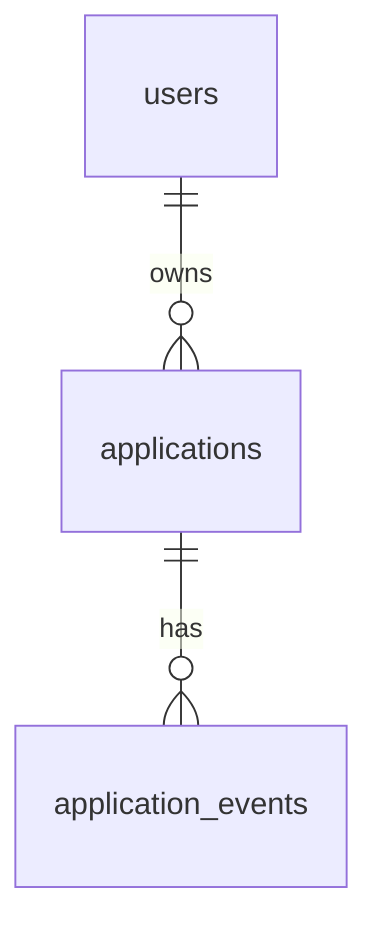

# Architecture des données

Base PostgreSQL (exemples écrits pour Supabase, transposables). Exemples SQL : `references/sql.md`. Tests exigés : `references/tests.md`.

## 1. Modéliser avant de coder
Pour chaque spec qui touche aux données, `.apv/data-model.md` existe et est validé avant la première migration :

~~~markdown
# Modèle de données
## Diagramme

## Tables
### applications
Rôle : <…>
| Colonne | Type | Null | Défaut | Contraintes |
|---|---|---|---|---|
| id | uuid | non | gen_random_uuid() | pk |
| user_id | uuid | non | | fk users(id) on delete cascade |
| … | | | | |
Règles de suppression : <justification>
RLS : <politiques>
## Écritures
<action> : transaction <fonction ou serveur>, clé d'idempotence <…>, invariant protégé par <…>, compensation <…>
## Verrous
Ordre : <parent avant enfants>. Délais : lock_timeout <…>, statement_timeout <…>.
## Redondances déclarées
<colonne> : raison <…>, garde-fou <…>
## Index
<index> : sert <requête>, vérifié par EXPLAIN sur <volume>
## Requêtes principales
<requête nommée> : colonnes, filtre, tri, pagination
~~~

## 2. Règles
1. **Nommage** : anglais `snake_case`, tables au pluriel, pour tables, colonnes, types énumérés, fonctions, politiques. Le français est réservé aux textes affichés.
2. **Clés** : UUID en clé primaire ; clé étrangère pour chaque relation, avec `on delete` explicite et justifié ; clé étrangère composite `(parent_id, user_id)` vers un `unique (id, user_id)` du parent quand l'enfant doit appartenir au même utilisateur.
3. **Contraintes en base** : `not null`, `check` (valeurs, bornes, plages de dates bornées, par exemple 1900-01-01 à 9999-12-31), `unique`, types énumérés. La validation serveur (zod ou équivalent) reprend exactement les mêmes bornes ; un test vérifie les deux.
4. **Types** : `date`, `timestamptz`, entiers ou `numeric` pour les montants ; pas de JSON fourre-tout pour des données structurées.
5. **RLS** : `enable` et `force` sur chaque table utilisateur ; politiques par opération avec `(select auth.uid())` ; droits par colonne (`grant insert (…)`, `grant update (…)`) quand une colonne est réservée à une fonction.
6. **`security definer`** : seulement si justifié ; `set search_path = ''` ; noms qualifiés ; propriétaire et droits vérifiés dans la fonction ; `revoke execute … from public` puis `grant` au seul rôle utile.
7. **Transactions** : toute écriture en plusieurs endroits dans une seule transaction (fonction SQL, ou transaction serveur explicite). Étape externe (stockage objet, e-mail, API) : compensation (annuler l'étape faite si la suite échoue) ou idempotence (réserver avant d'envoyer, clé d'unicité), avec un test d'échec à chaque étape.
8. **Concurrence** : invariants cassables par deux requêtes simultanées protégés en base (unicité, `select … for update`, `pg_advisory_xact_lock`) ; test d'appels concurrents.
9. **Écritures uniques** (trois niveaux, tous obligatoires) : interface (bouton en cours, `aria-busy`, clics suivants ignorés, soumission unique) ; serveur (clé d'idempotence UUID générée à l'affichage, champ caché, `unique (user_id, idempotency_key)`, la seconde requête renvoie le résultat de la première ; mises à jour qui posent une valeur au lieu de l'incrémenter ; actions « une fois » qui vérifient l'état dans la même transaction) ; base (unicité des clés naturelles).
10. **Verrou optimiste** : `version integer not null default 1` (ou `updated_at`) envoyée avec le formulaire, `update … set …, version = version + 1 where id = $1 and version = $2` ; zéro ligne touchée = conflit : message clair et valeur actuelle affichée, rien d'écrasé.
11. **Verrou pessimiste** : seulement dans une transaction courte qui lit puis écrit une valeur dont dépend un invariant.
12. **Règles de verrouillage** : aucun appel réseau sous verrou ; ordre fixe et écrit ; `lock_timeout` et `statement_timeout` réglés ; verrous consultatifs de transaction seulement.
13. **Normalisation** : BCNF par défaut, 3FN au minimum ; redondance déclarée avec raison et garde-fou (par exemple `user_id` répété pour la RLS, tenu par la clé composite ; valeur calculée maintenue par un déclencheur, jamais écrite par l'application).
14. **Index** : un par clé étrangère, un par motif de requête réel (filtre, tri, pagination), partiel quand une condition est constante ; vérifié par `EXPLAIN (analyze, buffers)` sur un volume réaliste.
15. **Charge utile minimale** : colonnes nommées, jamais `select *` ni `select('*')` ; la page ne reçoit que ce qu'elle affiche ; pagination et limites côté serveur ; pas de N+1, nombre de requêtes par chargement borné et testé.
16. **Migrations** : en avant seulement, nommées, testées depuis une base vide et sur des données existantes (nettoyer les lignes hors contrainte avant d'ajouter la contrainte).

## 3. Contrôle automatique
`apv db check` (contrôle déclaré, bloquant) signale : identifiants hors anglais `snake_case`, clé étrangère sans index, table utilisateur sans RLS activée et forcée, politique trop large, fonction `security definer` sans `search_path` fixé, `select *` dans le code serveur, table de création sans clé d'idempotence ni clé naturelle unique, colonne dupliquée sans garde-fou déclaré, parcours séquentiel d'une table utilisateur au-delà du seuil dans l'`EXPLAIN` des requêtes principales. Les conseillers de la base (par exemple ceux de Supabase) complètent quand ils existent.
